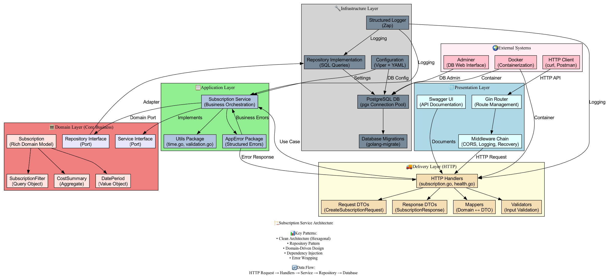
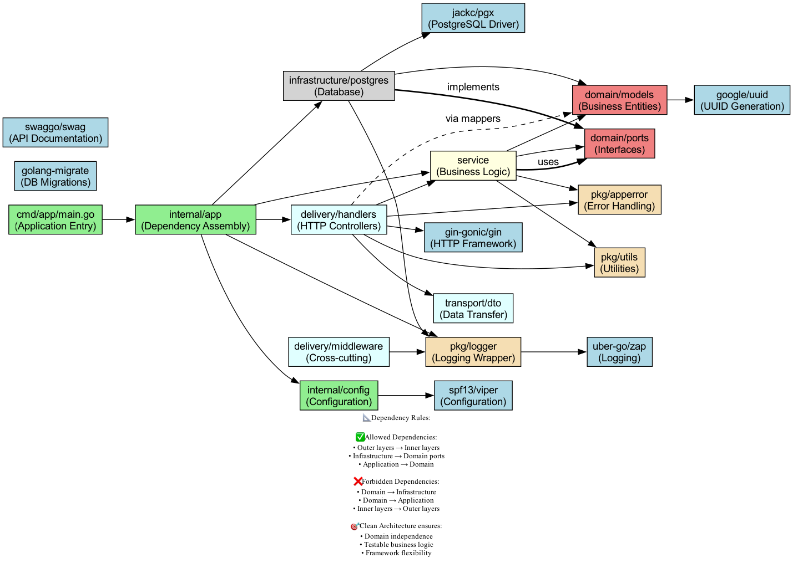
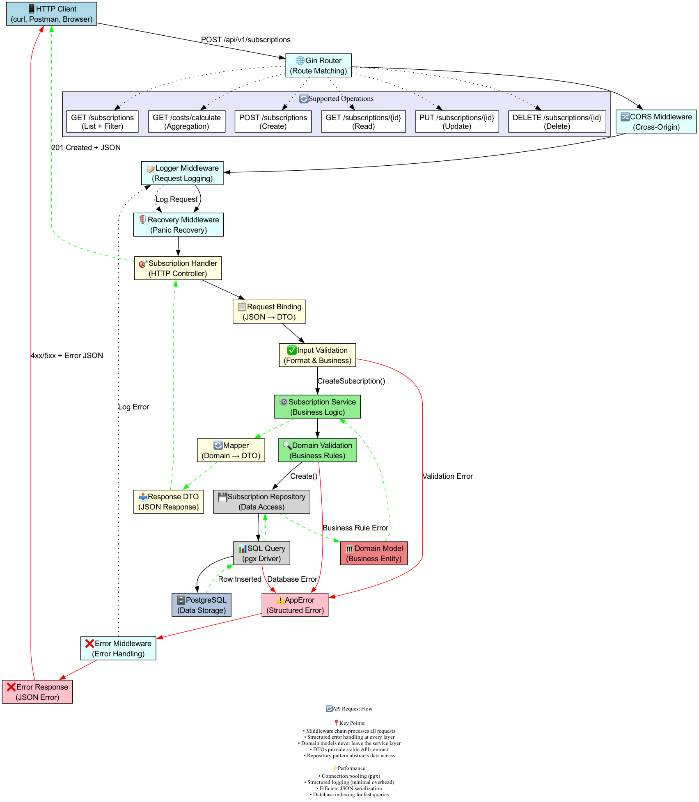

# Subscription Service with Clean Architecture

A production-ready REST API for managing user subscriptions built with Go, following Clean Architecture principles.

## Table of Contents

- [Architecture](#architecture)
- [System Design](#system-design)
- [Quick Start](#quick-start)
- [API Documentation](#api-documentation)
- [Endpoints](#endpoints)
- [Configuration](#configuration)
- [Development](#development)
- [Deployment](#deployment)
- [Project Structure](#project-structure)

### Key Features

- **Full CRUD Operations** - Create, read, update, and delete subscriptions
- **Cost Calculations** - Calculate subscription costs over custom time periods
- **Advanced Filtering** - Filter by user, service name, and date ranges
- **Pagination Support** - Efficient pagination for large datasets
- **Health Monitoring** - Built-in health checks for system monitoring
- **Swagger Documentation** - Interactive API documentation
- **Structured Logging** - JSON-based logging with correlation IDs
- **Database Migrations** - Version-controlled database schema
- **Docker Support** - Container-ready deployment

### Technology Stack

- **Language:** Go 
- **Database:** PostgreSQL with pgx driver
- **HTTP Framework:** Gin for high-performance routing
- **Configuration:** Viper with YAML/ENV support
- **Logging:** Zap for structured logging
- **Migrations:** golang-migrate for database versioning
- **Documentation:** Swagger/OpenAPI 3.0
- **Containerization:** Docker & Docker Compose

## Architecture

The service follows **Clean Architecture** principles with **Hexagonal Architecture** patterns, ensuring maintainable, testable, and scalable code.

### Architectural Overview



The architecture consists of four main layers:

```
┌─────────────────┐
│   Presentation  │  ← HTTP handlers, middleware, routing
├─────────────────┤
│   Application   │  ← Business logic orchestration  
├─────────────────┤
│     Domain      │  ← Core business models and rules
├─────────────────┤
│ Infrastructure  │  ← Database, external services
└─────────────────┘
```

### Dependency Flow



Dependencies flow inward toward the domain layer, ensuring:
- **Domain Independence** - Core business logic has no external dependencies
- **Testability** - Easy to mock and test individual components
- **Flexibility** - Can swap implementations without affecting business logic

### Request Flow



Each HTTP request follows a structured path through the system:
1. **Middleware Chain** - CORS, logging, recovery, error handling
2. **HTTP Handlers** - Request validation and response formatting
3. **Application Services** - Business logic orchestration
4. **Domain Models** - Core business rules and calculations
5. **Repository Layer** - Data persistence abstraction
6. **Database** - PostgreSQL with optimized queries

### Architectural Principles

- **Dependency Inversion** - Dependencies point inward toward the domain
- **Separation of Concerns** - Clear boundaries between layers
- **Single Responsibility** - Each component has one reason to change
- **Open/Closed Principle** - Open for extension, closed for modification
- **Interface Segregation** - Small, focused interfaces
- **Domain-Driven Design** - Rich domain models with business logic

### Key Patterns

- **Repository Pattern** - Abstract data access
- **Service Pattern** - Orchestrate business operations
- **DTO Pattern** - Stable API contracts
- **Error Wrapping** - Structured error handling
- **Dependency Injection** - Loose coupling between components

## System Design

### Database Schema

```sql
CREATE TABLE subscriptions (
    id UUID PRIMARY KEY DEFAULT uuid_generate_v4(),
    service_name VARCHAR(255) NOT NULL,
    price INTEGER NOT NULL CHECK (price > 0),
    user_id UUID NOT NULL,
    start_date TIMESTAMP WITH TIME ZONE NOT NULL,
    end_date TIMESTAMP WITH TIME ZONE,
    created_at TIMESTAMP WITH TIME ZONE NOT NULL DEFAULT NOW(),
    updated_at TIMESTAMP WITH TIME ZONE NOT NULL DEFAULT NOW()
);
```

### Performance Optimizations

- **Database Indexing** - Optimized indexes for common query patterns
- **Connection Pooling** - pgx connection pool for efficient database access
- **Structured Logging** - Minimal overhead JSON logging
- **Middleware Pipeline** - Efficient request processing chain

### Scalability Considerations

- **Stateless Design** - Horizontally scalable service instances
- **Database Optimization** - Indexed queries and connection pooling
- **Health Checks** - Ready for load balancer integration
- **Container Ready** - Docker support for container orchestration

## Quick Start

### Option 1: Docker (Recommended)

```bash
# Clone the repository
git clone 
cd subscription-service

# Start the full stack
make start

# The service will be available at:
# - API: http://localhost:8080
# - Swagger: http://localhost:8080/swagger/index.html
# - Database Admin: http://localhost:8081
```

### Option 2: Local Development

```bash
# Install dependencies
make install

# Start PostgreSQL (requires Docker)
docker-compose up postgres -d

# Run database migrations
make migrate

# Start the service
make run
```

### Quick Test

```bash
# Health check
curl http://localhost:8080/health

# Create a subscription
curl -X POST http://localhost:8080/api/v1/subscriptions \
  -H "Content-Type: application/json" \
  -d '{
    "service_name": "Yandex Plus",
    "price": 400,
    "user_id": "60601fee-2bf1-4721-ae6f-7636e79a0cba",
    "start_date": "07-2025"
  }'
```

## API Documentation

### Swagger UI

The service provides interactive API documentation via Swagger UI:

**URL:** [http://localhost:8080/swagger/index.html](http://localhost:8080/swagger/index.html)

The Swagger documentation includes:
- All available endpoints with parameters
- Request/response schemas
- Interactive testing interface
- Authentication requirements
- Example requests and responses

### Generating Documentation

```bash
# Generate Swagger docs
make docs

# Generate architecture diagrams
make diagrams

# The documentation will be available at /swagger/index.html when the service is running
```

## Endpoints

### Health Checks

| Method | Endpoint | Description |
|--------|----------|-------------|
| GET | `/health` | Overall application health |
| GET | `/health/ready` | Readiness probe (K8s) |
| GET | `/health/live` | Liveness probe (K8s) |

### Subscriptions

| Method | Endpoint | Description |
|--------|----------|-------------|
| POST | `/api/v1/subscriptions` | Create new subscription |
| GET | `/api/v1/subscriptions` | List subscriptions with filtering |
| GET | `/api/v1/subscriptions/{id}` | Get specific subscription |
| PUT | `/api/v1/subscriptions/{id}` | Update subscription |
| DELETE | `/api/v1/subscriptions/{id}` | Delete subscription |

### User Operations

| Method | Endpoint | Description |
|--------|----------|-------------|
| GET | `/api/v1/users/{id}/subscriptions` | Get user's subscriptions |
| GET | `/api/v1/users/{id}/subscriptions/stats` | Get user statistics |

### Cost Calculations

| Method | Endpoint | Description |
|--------|----------|-------------|
| GET | `/api/v1/costs/calculate` | Calculate subscription costs |

### Query Parameters

**Filtering:**
- `user_id` - Filter by user UUID
- `service_name` - Filter by service name
- `start_date` - Filter by start date (MM-YYYY format)
- `end_date` - Filter by end date (MM-YYYY format)

**Pagination:**
- `limit` - Number of results (default: 20, max: 100)
- `offset` - Number of results to skip (default: 0)

### Request/Response Examples

**Create Subscription:**
```json
POST /api/v1/subscriptions
{
  "service_name": "Netflix Premium",
  "price": 799,
  "user_id": "60601fee-2bf1-4721-ae6f-7636e79a0cba",
  "start_date": "01-2025",
  "end_date": "12-2025"
}
```

**Response:**
```json
{
  "id": "123e4567-e89b-12d3-a456-426614174000",
  "service_name": "Netflix Premium",
  "price": 799,
  "user_id": "60601fee-2bf1-4721-ae6f-7636e79a0cba",
  "start_date": "01-2025",
  "end_date": "12-2025",
  "created_at": "2025-01-15T10:30:00Z",
  "updated_at": "2025-01-15T10:30:00Z"
}
```

## Configuration

### Configuration Files

The service supports multiple configuration sources:

1. **YAML files** - `configs/config.yaml`
2. **Environment variables** - Override any YAML setting
3. **Command line flags** - Development overrides

### Environment Variables

| Variable | Description | Default |
|----------|-------------|---------|
| `SERVER_HOST` | Server bind address | `0.0.0.0` |
| `SERVER_PORT` | Server port | `8080` |
| `DATABASE_HOST` | PostgreSQL host | `localhost` |
| `DATABASE_PORT` | PostgreSQL port | `5432` |
| `DATABASE_USER` | Database username | `postgres` |
| `DATABASE_PASSWORD` | Database password | `postgres` |
| `DATABASE_DB_NAME` | Database name | `subscription_service` |
| `LOGGER_LEVEL` | Log level | `info` |
| `LOGGER_DEVELOPMENT` | Development mode | `false` |

### Example Configuration

```yaml
server:
  host: "0.0.0.0"
  port: "8080"
  read_timeout: 30
  write_timeout: 30

database:
  host: "localhost"
  port: "5432"
  user: "postgres"
  password: "postgres"
  db_name: "subscription_service"
  ssl_mode: "disable"

logger:
  level: "info"
  development: false
  encoding: "json"
```

## Development

### Prerequisites

- Go 1.21+
- Docker & Docker Compose
- PostgreSQL (for local development)

### Development Commands

```bash
# Install dependencies
make install

# Run tests
make test

# Run API integration tests
make test-api

# Generate architecture diagrams
make diagrams

# Start development environment
make run

# Stop services
make stop
```

### Code Structure

The project follows Clean Architecture with clear separation:

```
cmd/                    # Application entry points
├── app/               # Main application
└── migrator/          # Database migrator

internal/              # Private application code
├── app/               # Dependency injection
├── config/            # Configuration management
├── domain/            # Business logic (core)
│   ├── models/        # Domain entities
│   └── ports/         # Interfaces
├── service/           # Application services
├── infrastructure/    # External concerns
│   └── database/      # Database implementation
├── delivery/          # HTTP layer
│   └── http/          # HTTP handlers, middleware
└── transport/         # DTO layer
    └── http/          # Request/response DTOs

pkg/                   # Public packages
├── logger/            # Logging utilities
├── utils/             # Common utilities
└── apperror/          # Error handling
```

### Database Migrations

```bash
# Run migrations
make migrate

# Check migration status
go run cmd/migrator/main.go -action=version

# Rollback migrations
go run cmd/migrator/main.go -action=down
```

## Testing

### Test Structure

The project includes comprehensive testing at multiple levels:

- **Unit Tests** - Fast, isolated tests for business logic
- **Integration Tests** - Tests with real database connections
- **End-to-End Tests** - Full system tests through HTTP API
- **API Tests** - Automated testing scripts and collections

### API Testing Tools

The service includes multiple API testing approaches:

1. **Automated Script** - `./test-api.sh`
2. **HTTP Client Files** - `test-api.http` (VS Code/IntelliJ)
3. **Postman Collection** - `subscription-service.postman_collection.json`

### Test Coverage

The test suite covers:
- All CRUD operations
- Business logic validation
- Error handling scenarios
- Edge cases and boundary conditions
- Integration between layers

For detailed testing instructions, see [Testing Guide](README-TESTING.md).

## Deployment

### Docker Deployment

```bash
# Build and start all services
make start

# View logs
docker-compose logs -f app

# Stop services
make stop
```

### Production Configuration

For production deployment:

1. **Set environment variables** for sensitive configuration
2. **Configure SSL/TLS** for database connections
3. **Set up log aggregation** (ELK stack, Fluentd)
4. **Configure monitoring** (Prometheus, Grafana)
5. **Set up backup strategy** for PostgreSQL

### Kubernetes

The service is container-ready and includes health checks for Kubernetes:

- **Liveness probe:** `/health/live`
- **Readiness probe:** `/health/ready`
- **Metrics endpoint:** Ready for Prometheus integration

### Environment-Specific Configs

- `configs/config.yaml` - Development/default
- `configs/config-prod.yaml` - Production with env vars
- `configs/config-dev.yaml` - Development with debug logging

## Project Structure

```
subscription-service/
├── api/                   # API documentation
│   └── swagger/           # Generated Swagger docs
├── cmd/                   # Application entry points
├── configs/               # Configuration files
├── deployments/           # Docker & deployment configs
├── docs/                  # Project documentation
│   └── diagrams/          # Architecture diagrams
├── internal/              # Private application code
├── pkg/                   # Public reusable packages
├── scripts/               # Build and utility scripts
├── examples/              # Test infrastructure
├── test-api.http          # HTTP client tests
├── docker-compose.yml     # Local development stack
├── Dockerfile             # Container definition
├── Makefile               # Build automation
└── README.md              # This file
```

---

## Getting Help

- **API Reference:** Use the Swagger UI at `/swagger/index.html`
- **Architecture:** View generated diagrams in `/docs/diagrams/`

## License

This project is licensed under the MIT License.
